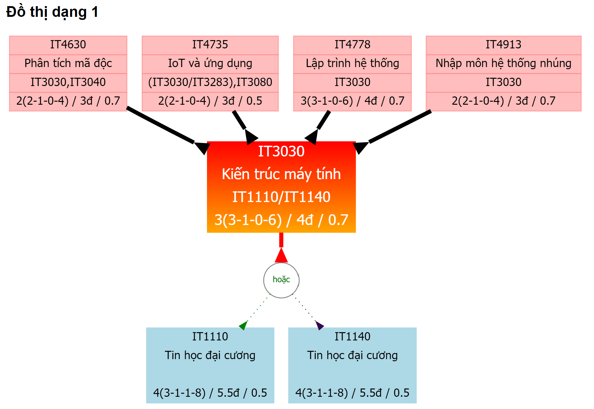
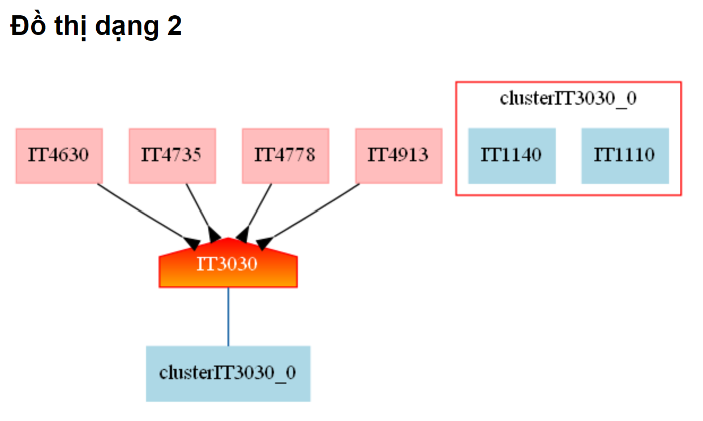
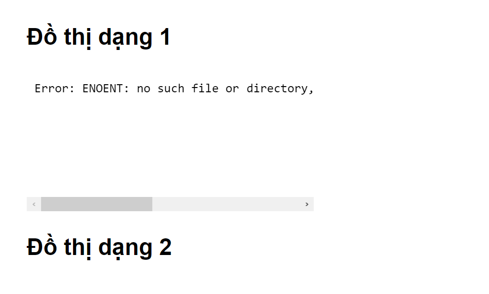
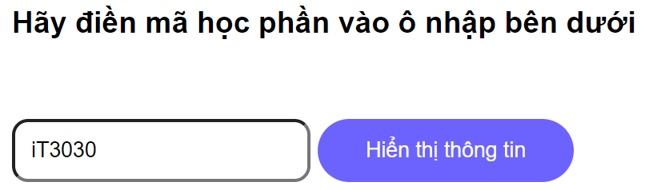

---
# Name of the article
title: "Course Condition in HUST"

# Quick description
description: Tool to check course conditions for HUST student.

# Author of the article
author: Puda14

# Appears as the tail of the output URL.
slug: "course-condition-in-hust"

# Date created
date: 2022-12-27T00:36:17+07:00

# Date published. Before that day, the post can not be available
publishDate: 

# Daye expired. After that day, the post can not be available
expiryDate:

# Last modified time of the file
lastmod: 
    - :fileModTime
    - :git
    
# Article's tags
tags: 
    - tool

# Article's categories: Blog, Project or Guideline
categories:
    - project

# Allow share?
socialShare: true

# Useful to link articles together for "See also" part
series: 

# is Math included? Default: false
math: false

# Cover image of the article
image: 
    cover.png

# License. Default: CC BY-NC-SA 4.0
license:

---

# Problem
In HUST,
some courses require completion of other courses, 
and most students don't pay attention to this problem.
Therefore, some cases of registering for a course without being able to study have occurred, leading to many difficulties during the semester.
So I think we need a tool to help check the course we want to register for, what other course conditions are needed.
# Solution
I crawled data of the courses from the hust student website and created a program that can solve the given problem and display as a tree.
## Operation
- ver 1: Display all the courses depending on the set of interest.
- ver 2: Continue tracing to form a full tree of dependencies.
- ver 3: Displays course name, number of credits, tuition credits, weighted final grades.

There will be two types of graphs displayed, `type 1` is more detailed than `type 2`.

`type 1`

  

`type 2`

  

If tool doesn't export the both tree, the courses code doesn't exist in the database.
`NOT FOUND`

  

## Usage
It's very easy to use !!!

>First, please enter your course code, regardless of uppercase or lowercase letters.

  

>Then the result will be displayed.

>If you want to see the condition of the courses that appear on the tree, click on it and you will see what you need.
# Prize
This project won the third prize in 
`the 2022 high application mvp product competition` 
organized by 
`svmc` 
and 
`soict`.

  

